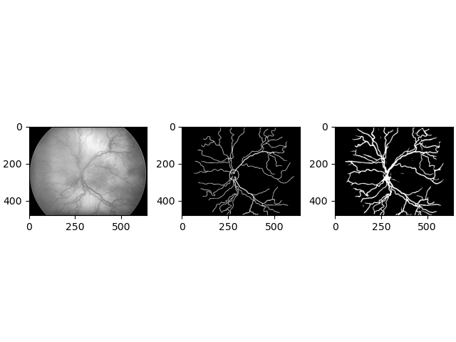

# vessel-segmentation



Left: Preprocessed input, Middle: Ground truth, Right: Prediction

### Summary
This repository contains code for a U-net model for vessel segmentation (Adapted from https://github.com/mitseng/RetinalVesselSegmentation) which is further used for ROP classification.

### Environment
**environment.yml** contains the dependencies for the conda environment.

### Training using db_train.csv: [Trained model will be stored in models/]
```
$ python3 main.py
```

### Evaluating using db_test.csv: [Outputs will be stored in outputs/]
```
$ python3 test.py
```

Authors:
1. Ashwin Vaswani
2. Praveer Singh
